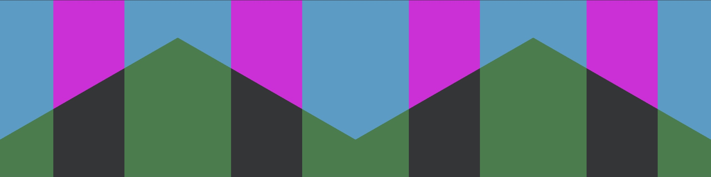

# Artistic Elements


[](https://www.jsdelivr.com/package/npm/artistic-elements)




Artistic Elements is a collection of very simple [Web Components](https://developer.mozilla.org/en-US/docs/Web/Web_Components) to create art.

This project was born out of wanting to learn about:

1. the [Web Components API](https://developer.mozilla.org/en-US/docs/Web/Web_Components)
2. the differences between that and using [Lit.dev](https://lit.dev/)
3. modern tooling, namely:
   1. [rollup.js](https://rollupjs.org/guide/en/)
   2. [@web/dev-server](https://modern-web.dev/docs/dev-server/overview/)

These artistic components were a result of, years ago, creating [swi{css}ted](https://swissted.koch.dev) with Styled Components in React and then using that work as the base for these ([Lit](https://lit.dev/)) Web Components.

## Development

To view examples:

```bash
npm i
npm start
```

Open [localhost:8000](http://localhost:8000/examples) to view available components.

### Contributing

Feel the need to add a new component? Awesome. Follow these basic steps:

1. Create a new branch from `develop`
2. Create a new Lit component in `src/artistic`
   1. `src/artistic/my-component`
3. Update `src/index.ts` to export your new component
   1. `export { ArtisticMyComponent } from './artistic/my-component';`
4. Update `examples/index.html` to include your component following the pattern found in the file
5. Create a new example file with some examples using attributes
6. Update the README to include the necessary details
7. Open a pull request to `develop`
   1. Be sure to include a screenshot of your new component in the pull request.

## In Use

Using it and want to show your art? Open up a pull request to update this section by adding to the list.

1. [swissted](https://swissted.koch.dev/)
2. [art.koch.dev](https://art.koch.dev/artistic-elements/)

## Import

Importing via the CDN is as simple as including the index as a module in your HTML. This includes all the components.

_Note: Remove '.min' from the path to use the unminified version from jsDeliver._

```html
<script
  type="module"
  src="https://cdn.jsdelivr.net/npm/artistic-elements@1.1.2/dist/index.min.js"
></script>
```

Cherry picking is also possible by targeting the specific component. See examples below.

Importing for JavaScript where the `*` is one of the available component names: `Circular`, `Rectangle`, etc.

```javascript
import { Artistic* } from 'artistic-elements';
```

Importing for React where the `*` is one of the available component names: `Circular`, `Rectangle`, etc.

```jsx
import { Artistic* } from 'artistic-elements/dist/react';
```

## Components

### Circular

A simple circular object with a single color.

To create a circle, use the same values for `width` and `height`.

#### Attributes

| Attribute | Description   | Type     | Default |
| --------- | ------------- | -------- | ------- |
| width     | object width  | `string` | '10rem' |
| height    | object height | `string` | '10rem' |
| color     | object color  | `string` | '#f0f'  |

#### Import

```html
<script
  type="module"
  src="https://cdn.jsdelivr.net/npm/artistic-elements@1.1.2/dist/artistic/circular.min.js"
></script>
```

#### HTML

```html
<artistic-circular></artistic-circular>
<artistic-circular
  width="20rem"
  height="20rem"
  color="#fff"
></artistic-circular>
```

#### Javascript API

```javascript
import { ArtisticCirular } from 'artistic-elements';

const circle = new ArtisticCirular();
circle.width = '20rem';
circle.height = '20rem';
circle.color = '#fff';
document.querySelector('main').append(circle);
```

#### React API

```jsx
import { ArtisticCircular } from 'artistic-elements/dist/react';

<ArtisticCircular />
<ArtisticCircular width="20rem" height="20rem" color="#fff" />
```

### Circular Gradient

A simple circular object with two colors, each color using 50% of the object.

Supply an angle in degrees to rotate.

To create a circle, use the same values for `width` and `height`.

#### Attributes

| Attribute | Description         | Type     | Default |
| --------- | ------------------- | -------- | ------- |
| width     | object width        | `string` | '10rem' |
| height    | object height       | `string` | '10rem' |
| angle     | object rotation     | `string` | '0deg'  |
| color     | object first color  | `string` | '#f0f'  |
| color2    | object second color | `string` | '#0f0'  |

#### Import

```html
<script
  type="module"
  src="https://cdn.jsdelivr.net/npm/artistic-elements@1.1.2/dist/artistic/circular-gradient.min.js"
></script>
```

#### HTML

```html
<artistic-circular-gradient></artistic-circular-gradient>
<artistic-circular-gradient
  width="20rem"
  height="20rem"
  color="#439dc8"
  color2="#377e49"
  angle="90deg"
></artistic-circular-gradient>
```

#### Javascript API

```javascript
import { ArtisticCircleGradient } from 'artistic-elements';

const circleGradient = new ArtisticCircleGradient();
circleGradient.width = '20rem';
circleGradient.height = '20rem';
circleGradient.color = '#fff';
circleGradient.color2 = '#000';
circleGradient.angle = '90deg';
document.querySelector('main').append(circleGradient);
```

#### React API

```jsx
import { ArtisticCircularGradient } from 'artistic-elements/dist/react';

<ArtisticCircularGradient />
<ArtisticCircularGradient
  width="20rem"
  height="20rem"
  color="#fff"
  color2="#000"
  angle="90deg"
/>
```

### Doughnut

A circle with a hole and a single color.

The `diameter` and `lineWidth` are used to calculate the overall `size` (width/height) in `rem`. TODO: choose `px` or `rem`?

```javascript
const size = diameter - lineWidth * 2;
```

Ability to position absolutely if either a top or left value is supplied.

#### Attributes

| Attribute | Description          | Type     | Default |
| --------- | -------------------- | -------- | ------- |
| diameter  | object diameter      | `number` | 10      |
| lineWidth | object border width  | `number` | 1       |
| color     | object color         | `string` | '#f0f'  |
| top       | object top position  | `string` | '0'     |
| left      | object left position | `string` | '0'     |

#### Import

```html
<script
  type="module"
  src="https://cdn.jsdelivr.net/npm/artistic-elements@1.1.2/dist/artistic/doughnut.min.js"
></script>
```

#### HTML

```html
<artistic-doughnut></artistic-doughnut>
<artistic-doughnut diameter="25" lineWidth="5" color="#000"></artistic-doughnut>
```

#### Javascript API

```javascript
import { ArtisticDoughnut } from 'artistic-elements';

const doughnut = new ArtisticDoughnut();
doughnut.diameter = 25;
doughnut.height = 5;
doughnut.color = '#fff';
document.querySelector('main').append(doughnut);
```

#### React API

```jsx
import { ArtisticDoughnut } from 'artistic-elements/dist/react';

<ArtisticDoughnut />
<ArtisticDoughnut diameter={25} height={5} color="#fff" />
```

### Rectangle

A simple rectangle with a single color.

Ability to position absolutely if either a top or left value is supplied.

Ability to `align` which maps to `align-self` for flexbox.

#### Attributes

| Attribute | Description          | Type     | default   |
| --------- | -------------------- | -------- | --------- |
| width     | object width         | `string` | '10rem'   |
| height    | object height        | `string` | '10rem'   |
| color     | object color         | `string` | '#f0f'    |
| top       | object top position  | `string` | '0'       |
| left      | object left position | `string` | '0'       |
| align     | object alignment     | `string` | 'initial' |

#### Import

```html
<script
  type="module"
  src="https://cdn.jsdelivr.net/npm/artistic-elements@1.1.2/dist/artistic/rectangle.min.js"
></script>
```

#### HTML

```html
<artistic-rectangle></artistic-rectangle>
<artistic-rectangle
  width="60rem"
  height="5rem"
  color="#000"
  align="end"
></artistic-rectangle>
```

#### Javascript API

```javascript
import { ArtisticRectangle } from 'artistic-elements';

const rectangle = new ArtisticRectangle();
rectangle.width = '60rem';
rectangle.height = '5rem';
rectangle.color = '#000';
rectangle.align = 'end';
document.querySelector('main').append(rectangle);
```

#### React API

```jsx
import { ArtisticRectangular } from 'artistic-elements/dist/react';

<ArtisticRectangular />
<ArtisticRectangular
  width="60rem"
  height="5rem"
  color="#000"
  align="end"
/>
```

### Rectangle Gradient

A simple rectangular object with two colors, each color using 50% of the object.

Ability to position absolutely if either a top or left value is supplied.

Ability to `align` which maps to `align-self` for flexbox.

#### Attributes

| Attribute | Description          | Type     | default   |
| --------- | -------------------- | -------- | --------- |
| width     | object width         | `string` | '10rem'   |
| height    | object height        | `string` | '10rem'   |
| angle     | object rotation      | `string` | '0deg'    |
| color     | object first color   | `string` | '#f0f'    |
| color2    | object second color  | `string` | '#0f0'    |
| top       | object top position  | `string` | '0'       |
| left      | object left position | `string` | '0'       |
| align     | object alignment     | `string` | 'initial' |

#### Import

```html
<script
  type="module"
  src="https://cdn.jsdelivr.net/npm/artistic-elements@1.1.2/dist/artistic/rectangle-gradient.min.js"
></script>
```

#### HTML

```html
<artistic-rectangle-gradient></artistic-rectangle-gradient>
<artistic-rectangle-gradient
  width="60rem"
  height="5rem"
  color="#000"
  color2="#fff"
></artistic-rectangle-gradient>
```

#### Javascript API

```javascript
import { ArtisticRectangleGradient } from 'artistic-elements';

const rectangleGradient = new ArtisticRectangleGradient();
rectangleGradient.width = '60rem';
rectangleGradient.height = '5rem';
rectangleGradient.color = '#000';
rectangleGradient.color2 = '#fff';
document.querySelector('main').append(rectangleGradient);
```

#### React API

```jsx
import { ArtisticRectangleGradient } from 'artistic-elements/dist/react';

<ArtisticRectangleGradient />
<ArtisticRectangleGradient
  width="60rem"
  height="5rem"
  color="#000"
  color2="fff"
/>
```

### Triangle Rectangle

Uses the [css border trick](https://css-tricks.com/snippets/css/css-triangle/) to create a rectangular object made up of 4 triangles.

To create a square, use the same values for `width` and `height`.

The `borderStyle` defaults to `solid`. Any valid value for `border-style` is acceptable.

The colors map to each of the borders (top, right, bottom, left).

#### Attributes

| Attribute   | Description           | Type     | Default |
| ----------- | --------------------- | -------- | ------- |
| width       | object width          | `number` | 10      |
| height      | object height         | `number` | 10      |
| borderStyle | object border-style   | `string` | 'solid' |
| topColor    | top triangle color    | `string` | '#f0f'  |
| rightColor  | right triangle color  | `string` | '#0f0'  |
| bottomColor | bottom triangle color | `string` | '#ff0'  |
| leftColor   | left triangle color   | `string` | '#00f'  |

#### Import

```html
<script
  type="module"
  src="https://cdn.jsdelivr.net/npm/artistic-elements@1.1.2/dist/artistic/triangle-rectangle.min.js"
></script>
```

#### HTML

```html
<artistic-triangle-rectangle></artistic-triangle-rectangle>
<artistic-triangle-rectangle
  width="20"
  height="20"
  topColor="#63fd86"
  rightColor="#8601ff"
  bottomColor="#35e8c2"
  leftColor="#63fd86"
></artistic-triangle-rectangle>
```

#### Javascript API

```javascript
import { ArtisticTriangleRectangle } from 'artistic-elements';

const square = new ArtisticTriangleRectangle();
square.width = '20';
square.height = '20';
square.topColor = '#63fd86';
square.rightColor = '#8601ff';
square.bottomColor = '#35e8c2';
square.leftColor = '#63fd86';
document.querySelector('main').append(square);
```

#### React API

```jsx
import { ArtisticTriangleRectangular } from 'artistic-elements/dist/react';

<ArtisticTriangleRectangular />
<ArtisticTriangleRectangular
  width={20}
  height={20}
  topColor="#63fd86"
  rightColor="#8601ff"
  bottomColor="#35e8c2"
  leftColor="#63fd86"
/>
```

### Triangle Up

[CSS border trick](https://css-tricks.com/snippets/css/css-triangle/) to create a triangle object that points up with a single color.

`height` determines overall height of the triangle.

`widthLeft` and `widthRight` determine the left and right width (50% each), respectively.

If the `height` is 2x the value of `widthLeft` and `widthRight` (and both `widthLeft` and `widthRight` are the same value), the triangle will fit in a square with the top point at the midway point of the top side of the square. This is the default behavior.

#### Attributes

| Attribute  | Description             | Type     | Default |
| ---------- | ----------------------- | -------- | ------- |
| widthLeft  | object left side width  | `string` | '5rem'  |
| widthRight | object right side width | `string` | '5rem'  |
| height     | object height           | `string` | '10rem' |
| color      | object color            | `string` | '#0f0'  |

#### Import

```html
<script
  type="module"
  src="https://cdn.jsdelivr.net/npm/artistic-elements@1.1.2/dist/artistic/triangle-up.min.js"
></script>
```

#### HTML

```html
<artistic-triangle-up></artistic-triangle-up>
<artistic-triangle-up
  widthLeft="10rem"
  widthRight="10rem"
  height="20rem"
  color="#fff"
></artistic-triangle-up>
```

#### Javascript API

```javascript
import { ArtisticTriangleUp } from 'artistic-elements';

const triangleUp = new ArtisticTriangleUp();
triangleUp.widthLeft = '10rem';
triangleUp.widthRight = '10rem';
triangleUp.height = '20rem';
triangleUp.color = '#fff';
document.querySelector('main').append(triangleUp);
```

#### React API

```jsx
import { ArtisticTriangleUp } from 'artistic-elements/dist/react';

<ArtisticTriangleUp />
<ArtisticTriangleUp
  widthLeft="10rem"
  widthRight="10rem"
  height="20rem"
  color="#fff"
/>
```

### Triangle Down

[CSS border trick](https://css-tricks.com/snippets/css/css-triangle/) to create a triangle object that points down with a single color.

`height` determines overall height of the triangle.

`widthLeft` and `widthRight` determine the left and right width (50% each), respectively.

If the `height` is 2x the value of `widthLeft` and `widthRight` (and both `widthLeft` and `widthRight` are the same value), the triangle will fit in a square with the bottom point at the midway point of the bottom side of the square. This is the default behavior.

#### Attributes

| Attribute  | Description             | Type     | Default |
| ---------- | ----------------------- | -------- | ------- |
| widthLeft  | object left side width  | `string` | '5rem'  |
| widthRight | object right side width | `string` | '5rem'  |
| height     | object height           | `string` | '10rem' |
| color      | object color            | `string` | '#0f0'  |

#### Import

```html
<script
  type="module"
  src="https://cdn.jsdelivr.net/npm/artistic-elements@1.1.2/dist/artistic/triangle-down.min.js"
></script>
```

#### HTML

```html
<artistic-triangle-down></artistic-triangle-down>
<artistic-triangle-down
  widthLeft="10rem"
  widthRight="10rem"
  height="20rem"
  color="#fff"
></artistic-triangle-down>
```

#### Javascript API

```javascript
import { ArtisticTriangleDown } from 'artistic-elements';

const triangleDown = new ArtisticTriangleDown();
triangleDown.widthLeft = '10rem';
triangleDown.widthRight = '10rem';
triangleDown.height = '20rem';
triangleDown.color = '#fff';
document.querySelector('main').append(triangleDown);
```

#### React API

```jsx
import { ArtisticTriangleDown } from 'artistic-elements/dist/react';

<ArtisticTriangleDown />
<ArtisticTriangleDown
  widthLeft="10rem"
  widthRight="10rem"
  height="20rem"
  color="#fff"
/>
```

### Triangle Left

[CSS border trick](https://css-tricks.com/snippets/css/css-triangle/) to create a triangle object that points to the left with a single color.

`width` determines overall width of the triangle.

`heightTop` and `heightBottom` determine the top and bottom height (50% each), respectively.

If the `width` is 2x the value of `heightTop` and `heightBottom` (and both `heightTop` and `heightBottom` are the same value), the triangle will fit in a square with the left point at the midway point of the left side of the square. This is the default behavior.

#### Attributes

| Attribute    | Description             | Type     | Default |
| ------------ | ----------------------- | -------- | ------- |
| heightTop    | object left side width  | `string` | '5rem'  |
| heightBottom | object right side width | `string` | '5rem'  |
| width        | object height           | `string` | '10rem' |
| color        | object color            | `string` | '#0f0'  |

#### Import

```html
<script
  type="module"
  src="https://cdn.jsdelivr.net/npm/artistic-elements@1.1.2/dist/artistic/triangle-left.min.js"
></script>
```

#### HTML

```html
<artistic-triangle-left></artistic-triangle-left>
<artistic-triangle-left
  heightTop="10rem"
  heightBottom="10rem"
  width="20rem"
  color="#fff"
></artistic-triangle-left>
```

#### Javascript API

```javascript
import { ArtisticTriangleLeft } from 'artistic-elements';

const triangleLeft = new ArtisticTriangleLeft();
triangleDown.heightTop = '10rem';
triangleDown.heightBottom = '10rem';
triangleDown.width = '20rem';
triangleDown.color = '#fff';
document.querySelector('main').append(triangleDown);
```

#### React API

```jsx
import { ArtisticTriangleLeft } from 'artistic-elements/dist/react';

<ArtisticTriangleLeft />
<ArtisticTriangleLeft
  heightTop="10rem"
  heightBottom="10rem"
  width="20rem"
  color="#fff"
/>
```

### Triangle Right

[CSS border trick](https://css-tricks.com/snippets/css/css-triangle/) to create a triangle object that points to the right with a single color.

`width` determines overall width of the triangle.

`heightTop` and `heightBottom` determine the top and bottom height (50% each), respectively.

If the `width` is 2x the value of `heightTop` and `heightBottom` (and both `heightTop` and `heightBottom` are the same value), the triangle will fit in a square with the right point at the midway point of the right side of the square. This is the default behavior.

#### Attributes

| Attribute    | Description             | Type     | Default |
| ------------ | ----------------------- | -------- | ------- |
| heightTop    | object left side width  | `string` | '5rem'  |
| heightBottom | object right side width | `string` | '5rem'  |
| width        | object height           | `string` | '10rem' |
| color        | object color            | `string` | '#0f0'  |

#### Import

```html
<script
  type="module"
  src="https://cdn.jsdelivr.net/npm/artistic-elements@1.1.2/dist/artistic/triangle-right.min.js"
></script>
```

#### HTML

```html
<artistic-triangle-right></artistic-triangle-right>
<artistic-triangle-right
  heightTop="10rem"
  heightBottom="10rem"
  width="20rem"
  color="#fff"
></artistic-triangle-right>
```

#### Javascript API

```javascript
import { ArtisticTriangleRight } from 'artistic-elements';

const triangleRight = new ArtisticTriangleRight();
triangleRight.heightTop = '10rem';
triangleRight.heightBottom = '10rem';
triangleRight.width = '20rem';
triangleRight.color = '#fff';
document.querySelector('main').append(triangleRight);
```

#### React API

```jsx
import { ArtisticTriangleRight } from 'artistic-elements/dist/react';

<ArtisticTriangleRight />
<ArtisticTriangleRight
  heightTop="10rem"
  heightBottom="10rem"
  width="20rem"
  color="#fff"
/>
```
